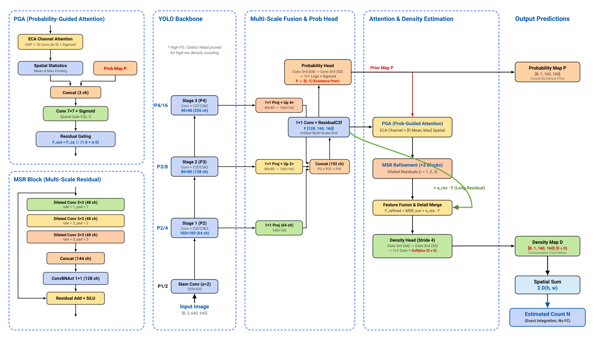
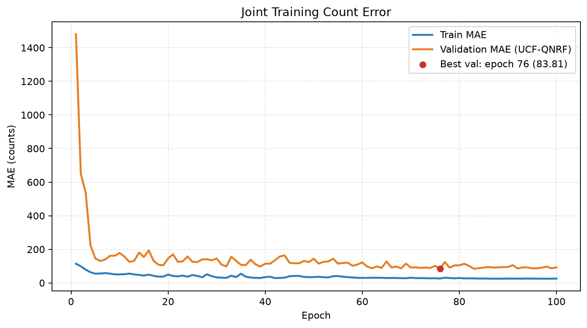
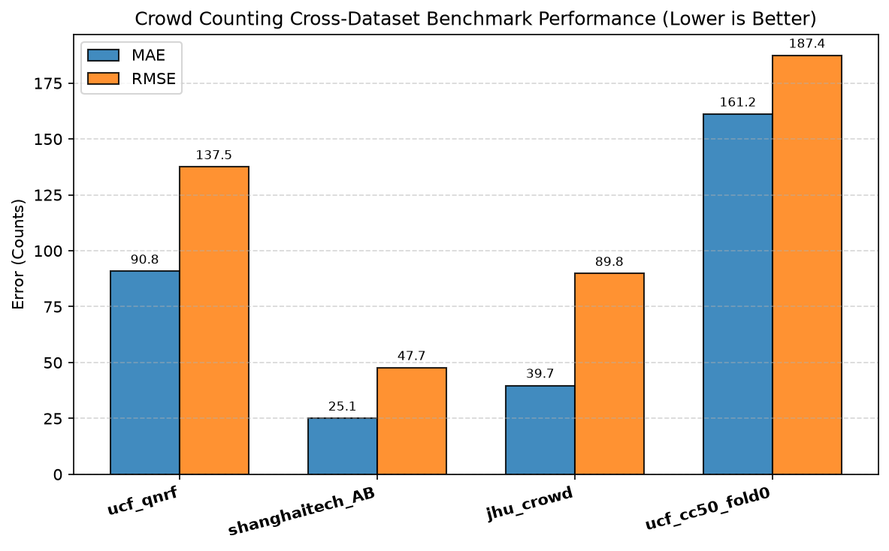
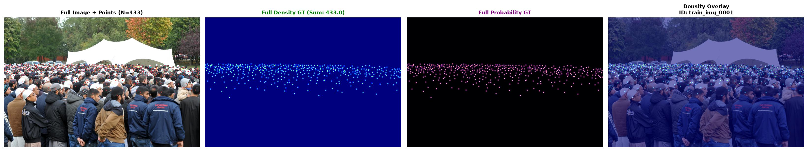
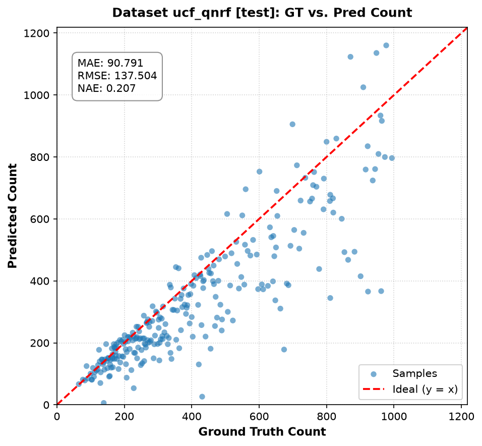
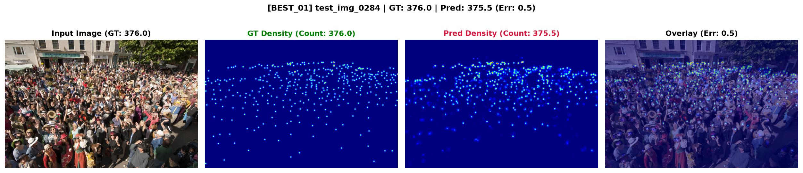
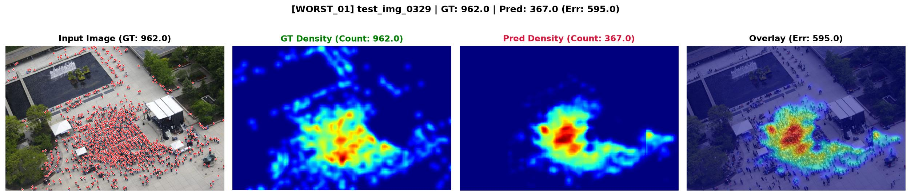

# YOLO-PGMD 人群计数

基于 YOLO 多尺度特征与概率引导密度图的端到端人群计数实现。模型不回归一个独立的人数标量，而是先预测非负密度图，再通过密度积分得到人数：

```text
输入图像 → YOLO P2/P3/P4 特征 → 多尺度融合 → 概率图
      → 概率引导注意力 → 多尺度残差细化 → 密度图 → ΣD = 人数
```

> **项目状态**：模型训练、联合数据集评测与推理可视化流程均已完成。当前仓库提供训练代码、评测代码、架构图和可复现实验配置；训练权重通过 Google Drive 提供下载。

## 目录

- [项目概览](#项目概览)
- [已训练权重与结果](#已训练权重与结果)
- [训练与数据可视化](#训练与数据可视化)
- [模型架构](#模型架构)
- [环境安装](#环境安装)
- [数据准备](#数据准备)
- [快速推理](#快速推理)
- [评估与基准测试](#评估与基准测试)
- [重新训练](#重新训练)
- [训练配置](#训练配置)
- [代码结构](#代码结构)
- [接口约定](#接口约定)
- [测试](#测试)

## 项目概览

YOLO-PGMD 面向高分辨率、密集人群图像，核心设计如下：

- **密度守恒**：每个标注点生成一个积分为 1 的高斯密度核；即使核被图像边界截断，也会对可见部分重新归一化，因此目标密度图满足 `ΣD = 标注人数`。
- **概率图与密度图分工**：概率图表达“哪里可能有人头”，密度图负责精确计数；两者使用不同的监督目标。
- **固定输出步长**：输入裁剪为 `640×640`，输出密度图为 `160×160`，保持 stride-4 分辨率以保留小人头空间信息。
- **整图滑窗推理**：高分辨率图像采用 `640×640` tile、步长 `512` 的重叠滑窗，重叠区域使用二维余弦权重融合，避免边界重复计数。
- **分阶段迁移学习**：先冻结主干，再解冻高层，最后全量解冻；主干和任务头采用分层学习率。
- **可消融模块**：`use_probability`、`use_attention`、`use_msr` 可分别关闭，用于比较各模块贡献。
- **统一前向接口**：训练、验证和推理均使用 `model(images) → dict`，不需要切换不同的模型输出逻辑。

## 已训练权重与结果

### 权重下载

已训练模型文件名为 `CrowedSigmodBest.pt`：

- [Google Drive 查看 / 下载权重](https://drive.google.com/file/d/1mMlZDy-BlvsMqmAW1JiZU5Y3TuUuFAlt/view?usp=drive_link)
- 命令行下载：

  ```bash
  mkdir -p checkpoints
  curl -L 'https://drive.usercontent.google.com/download?id=1mMlZDy-BlvsMqmAW1JiZU5Y3TuUuFAlt&export=download' \
    -o checkpoints/CrowedSigmodBest.pt
  ```

该文件是本项目训练脚本保存的完整 checkpoint（包含 `model`、`optimizer`、epoch 和评测指标），不是 Ultralytics 检测模型的裸权重或纯 `state_dict`；请通过本仓库的 `infer.py`、`evaluate.py` 或 `train_all.py` 加载。推理入口不读取 YAML，而是按默认 `CrowdCounter` 结构构建模型，因此使用当前权重时应保持默认的 `yolo11n` 主干和 head 配置，并安装 `ultralytics` 以匹配训练时的 YOLO 后端。仓库仍保留无 Ultralytics 时的本地轻量回退编码器，适用于离线构建和从头训练场景，但回退编码器不保证能加载该 YOLO 主干 checkpoint。

### 联合训练基准

以下结果来自已完成的联合训练实验：

- 配置：`configs/crowd.yaml`
- 模式：`joint`
- 设备：CUDA
- 训练轮数：100
- 联合训练图像数：3,572（UCF-QNRF 852、ShanghaiTech A+B 602、JHU-Crowd 2,102、UCF-CC-50 fold0 16）
- 最优验证 MAE：第 76 轮，`83.81`（checkpoint 只根据 UCF-QNRF 的 93 张 val 图选择；其他数据集的 Val/Test 指标使用该 checkpoint 评估）
- 评测方式：固定整图 tiling，不使用随机裁剪

| 数据集 | Val 图像数 | Val MAE | Test 图像数 | Test MAE | Test RMSE | Test NAE |
| --- | ---: | ---: | ---: | ---: | ---: | ---: |
| UCF-QNRF | 93 | 83.81 | 266 | 90.79 | 137.50 | 0.2069 |
| ShanghaiTech A+B | 65 | 28.47 | 479 | 25.09 | 47.67 | 0.1090 |
| JHU-Crowd | 469 | 35.40 | 1,488 | 39.73 | 89.80 | 0.3118 |
| UCF-CC-50 fold0 | 3 | 63.35 | 6 | 161.16 | 187.39 | 0.2908 |
| **简单平均** | — | **52.76** | — | **79.19** | **115.59** | — |

> UCF-CC-50 此处只评测仓库当前整理的 `fold0`：`16` 张 train、`3` 张 val、`6` 张 test。测试集仅 6 张图，且该划分不是完整官方五折协议的直接替代，结果不应与完整五折交叉验证或论文排行榜直接比较。表中平均值是按数据集指标做的简单平均，不是按图像数量加权的平均。
>
> 指标定义：`MAE = mean(|pred - gt|)`，单位为人数；`RMSE = sqrt(mean((pred - gt)^2))`，对大误差更敏感；`NAE = mean(|pred - gt| / max(gt, 1))`，无量纲。
>
> 联合训练只有一个共享 checkpoint；`best.pt` 的选择指标来自 UCF-QNRF 主验证集，不是四个数据集验证指标的平均值。

当前实验产物位于 `runs/joint_20260819_171626/`，包括：

> `runs/`、`datasets/` 和 `*.pt` 已被 `.gitignore` 排除。下面的 `runs/...` 路径是本次工作区中的实验产物，普通 clone 不会自动包含；重新评测需要下载权重并重新生成这些文件。

- `summary_report.md`：跨数据集汇总报告
- `summary_metrics.json` / `summary_metrics.csv`：结构化指标
- `benchmark_comparison.png`：跨数据集指标对比图
- `joint_model/best.pt`：联合训练最优检查点
- `joint_model/eval_per_dataset/`：逐数据集指标、散点图和定性可视化

## 模型架构

仓库中的完整架构图：



前向计算流程：

1. **YOLO Backbone**：复用 YOLO 的 P2/P3/P4 特征，步长分别为 4、8、16；不使用检测 neck 和 Detect head。
2. **Multi-Scale Fusion**：各尺度特征经过 `1×1` 投影，上采样到 P2 分辨率后拼接并融合为 `128` 通道特征。
3. **Probability Head**：输出头部概率图 `P`，用于概率监督和注意力引导。
4. **Probability-Guided Attention**：结合 ECA 通道注意力与概率图、均值图、最大值图构成的空间注意力。
5. **MSR Refinement**：使用 3 个多尺度残差块，并行膨胀率为 `[1, 2, 3]`。
6. **Density Head**：通过 Softplus 输出非负密度图 `D`。
7. **Count**：对密度图全部像素求和，得到浮点人数 `count = ΣD`，不经过全连接回归器。

## 训练与数据可视化

本节图片来自已完成的联合训练与数据质检流程，已复制到 `assets/readme/`，不依赖被 `.gitignore` 排除的 `runs/` 目录。

### 训练曲线

训练共 100 个 epoch。橙色曲线是作为主 checkpoint 选择依据的 UCF-QNRF 验证集 MAE，红点标记第 76 个日志 epoch 的最佳验证结果（MAE `83.81`）。

<p align="center">
  
</p>

### 跨数据集测试误差

联合 checkpoint 在四个数据集上的 Test MAE / RMSE 对比如下，数值越低越好。UCF-CC-50 这里仍然是当前仓库的 `fold0` 划分。

<p align="center">
  
</p>

### 数据与标签生成

下图展示一张 UCF-QNRF 训练样本及其点标注、守恒密度图、概率图和密度叠加效果。该样本真实人数为 `433`，密度 GT 的积分也为 `433`。

<p align="center">
  
</p>

### 预测散点与定性结果

UCF-QNRF 测试集的 GT-预测人数散点图：

<p align="center">
  
</p>

同一测试集中的一个低误差样本和一个高误差样本如下。保留高误差样本用于展示模型当前仍然容易失真的场景，避免只展示成功案例。

<table>
  <tr>
    <td align="center"><strong>低误差样本：GT 376，Pred 375.5</strong></td>
    <td align="center"><strong>高误差样本：GT 962，Pred 367</strong></td>
  </tr>
  <tr>
    <td></td>
    <td></td>
  </tr>
</table>

## 环境安装

项目要求 Python `>=3.10`，核心依赖定义在 `pyproject.toml`：

```bash
python -m venv .venv
source .venv/bin/activate
python -m pip install --upgrade pip
pip install -e .
```

推荐安装 Ultralytics 后端，以加载训练配置中的 `yolo11n.yaml` 和 `yolo11n.pt`：

```bash
pip install -e '.[yolo]'
```

如果使用 UCF-QNRF、UCF-CC-50 或 ShanghaiTech 的 MATLAB `.mat` 标注，还需要安装 `scipy`：

```bash
pip install scipy
```

### 参考训练环境

本次联合训练使用的工作站 GPU 信息如下（来自 `nvidia-smi`）：

| 项目 | 信息 |
| --- | --- |
| GPU | NVIDIA GeForce RTX 5060 Ti |
| 显存 | 约 16 GiB（`16311 MiB`） |
| NVIDIA-SMI | `610.53` |
| KMD Driver | `610.74` |
| CUDA UMD | `13.3` |
| 本项目默认设置 | `image_size=640`、`batch_size=8`、`device=cuda` |

显存较小的 GPU 可优先降低 `training.batch_size`，不需要修改模型结构。

## 数据准备

原始数据集和整理后的数据目录由 `.gitignore` 排除，需要在本地准备。统一目录约定如下：

```text
datasets/<dataset_name>/
├── dataset.yaml                 # 可选说明文件；实际路径由 config/CLI 控制
├── images/
│   ├── train/*.jpg
│   ├── val/*.jpg
│   └── test/*.jpg
├── points/
│   ├── train/*.txt
│   ├── val/*.txt
│   └── test/*.txt
└── labels/                      # 可选，points 不存在时回退
    ├── train/*.txt
    ├── val/*.txt
    └── test/*.txt
```

当前批量入口支持以下数据集名称：

- `ucf_qnrf`
- `shanghaitech_AB`
- `jhu_crowd`
- `ucf_cc50`（按 fold 目录读取；`sequential` 可逐 fold 独立训练，`joint` 会合并训练数据后逐 fold 评测）

UCF-CC-50 需要使用 fold 目录，而不是通用的 `train/val/test` 目录：

```text
datasets/ucf_cc50/
├── images/fold0_train/*.jpg
├── images/fold0_val/*.jpg
├── images/fold0_test/*.jpg
├── points/fold0_train/*.txt
├── points/fold0_val/*.txt
├── points/fold0_test/*.txt
├── labels/fold0_train/*.txt
├── labels/fold0_val/*.txt
└── labels/fold0_test/*.txt
```

点标注支持以下格式，读取时会自动识别：

| 格式 | 示例 | 解析方式 |
| --- | --- | --- |
| 归一化点 | `0.029839 0.126829` | 按图像宽高还原为像素坐标 |
| YOLO 标签 | `0 0.5 0.5 0.01 0.01` | 读取 `class cx cy w h` 中心点 |
| 像素框 | `x1 y1 x2 y2` | 取 bbox 中心点 |

裁剪使用半开区间：点 `(x, y)` 属于 `[x0, x0+w) × [y0, y0+h)`，因此位于相邻 tile 边界上的点只会被计数一次。

## 快速推理

将下载的权重保存为 `checkpoints/CrowedSigmodBest.pt` 后，对单张图像执行：

```bash
python infer.py path/to/image.jpg \
  --checkpoint checkpoints/CrowedSigmodBest.pt \
  --device cuda \
  --output runs/infer_results
```

默认使用 `tile_size=640`、`tile_stride=512`、`output_stride=4`。程序会：

- 在终端打印 `count=<预测人数>`；
- 保存 `<image>_result.json`；
- 保存组合图 `<image>_composite.jpg`；
- 保存密度热力图 `<image>_heatmap.jpg`；
- 保存原图叠加图 `<image>_overlay.jpg`。

CPU 推理只需将 `--device cuda` 改为 `--device cpu`。也可以显式覆盖滑窗参数：

```bash
python infer.py path/to/image.jpg \
  --checkpoint checkpoints/CrowedSigmodBest.pt \
  --device cuda \
  --tile-size 640 \
  --tile-stride 512 \
  --output-stride 4
```

## 评估与基准测试

### 单数据集验证集评估

`evaluate.py` 根据 `configs/crowd.yaml` 中的 `data.root` 和 `val_split` 评估一个检查点：

```bash
python evaluate.py \
  --config configs/crowd.yaml \
  --checkpoint checkpoints/CrowedSigmodBest.pt \
  --device cuda \
  --output runs/eval_qnrf
```

输出包括 `eval_metrics.json`、GT 与预测人数散点图，以及按误差排序挑选的定性样本图。

### 多数据集批量评测

已有权重可直接在所有数据集上评测：

```bash
python train_all.py \
  --mode eval_only \
  --datasets all \
  --checkpoint checkpoints/CrowedSigmodBest.pt \
  --ucf-cc50-folds 0 \
  --device cuda
```

批量入口会生成带时间戳的 `runs/eval_only_<timestamp>/`，并输出汇总 Markdown、JSON、CSV、柱状图和逐数据集可视化。

## 重新训练

### 单数据集训练

```bash
python train.py \
  --config configs/crowd.yaml \
  --device cuda
```

命令行可覆盖训练轮数和输出目录：

```bash
python train.py \
  --config configs/crowd.yaml \
  --epochs 100 \
  --output runs/my_experiment \
  --device cuda
```

### 联合训练与基准评测

```bash
python train_all.py \
  --mode joint \
  --datasets all \
  --epochs 100 \
  --device cuda
```

顺序训练每个数据集并分别评测：

```bash
python train_all.py \
  --mode sequential \
  --datasets all \
  --device cuda
```

常用选项：

- `--datasets ucf_qnrf shanghaitech_AB`：只运行指定数据集；
- `--epochs N`：覆盖配置中的训练轮数；
- `--batch-size N`：覆盖 batch size；
- `--workers N`：覆盖 DataLoader worker 数；
- `--output DIR`：指定批量实验输出目录；
- `--ucf-cc50-folds all`：`sequential` 模式逐 fold 独立训练；`joint` 模式合并各 fold 的训练数据后逐 fold 评测，不等价于标准五折交叉验证；
- `--no-test-after-train`：训练后跳过测试集评估。

## 训练配置

默认配置文件为 `configs/crowd.yaml`，主要参数如下：

| 类别 | 参数 | 当前值 |
| --- | --- | --- |
| 输入 | `image_size` / `output_stride` | `640` / `4` |
| 主干 | `backbone` | `yolo11n.yaml` |
| 融合 | `fusion_channels` / `projection_channels` | `128` / `64` |
| 精化 | `msr_blocks` / `dilations` | `3` / `[1, 2, 3]` |
| 标签 | `probability_sigma` / `density_sigma` | `2.0` / `2.0` |
| 训练 | `epochs` / `batch_size` | `100` / `8` |
| 优化 | `learning_rate` / `weight_decay` | `5e-4` / `1e-4` |
| 解冻 | `freeze_epochs` / `partial_unfreeze_epoch` / `full_unfreeze_epoch` | `15` / `15` / `45` |
| 调度 | `warmup_epochs` | `5` |
| 推理 | `tile_size` / `tile_stride` | `640` / `512` |

训练阶段：

| 阶段 | 日志 Epoch 范围 | 主干状态 | 学习率策略 |
| --- | --- | --- | --- |
| frozen | `1–15`（配置边界 `15`） | 冻结 | 仅训练任务头 |
| partial | `16–45`（配置边界 `15–45`） | 解冻高层 | 主干高层使用 `0.02×` 基础学习率 |
| full | `46–100`（配置边界 `45`） | 全部解冻 | 主干低层使用 `0.005×` 基础学习率 |

损失由四部分组成：

- 概率损失：`BCE + 0.2 × (1 - Dice coefficient)`；
- 密度损失：先计算 `density_scale × |D - D_gt|^density_power` 的像素误差和，再除以 `count_gt + 1` 做样本级归一化；
- 全局计数损失：`|ΣD - count_gt| / (count_gt + 1)`；
- 局部计数损失：将密度图划分为 `4×4` 区域，对每个区域使用对应 GT 密度和 `+1` 的相对误差。

默认权重为 `probability=1.0`、`density=1.0`、`count=0.5`、`local=0.25`。

## 代码结构

```text
.
├── configs/crowd.yaml              # 默认实验配置
├── data/
│   ├── crowd_dataset.py            # 数据集、动态裁剪、整图读取
│   ├── target_generator.py         # 概率图与守恒密度图生成
│   └── transforms.py               # 图像与点标注同步增强
├── models/
│   ├── yolo_encoder.py             # YOLO 主干与本地回退编码器
│   ├── feature_fusion.py           # 多尺度特征融合
│   ├── probability_head.py         # 概率图分支
│   ├── attention.py                # 概率引导注意力
│   ├── msr.py                      # 多尺度残差细化
│   ├── density_head.py             # 非负密度输出头
│   └── crowd_counter.py            # 端到端模型与 forward 契约
├── losses/crowd_loss.py            # 概率、密度、全局和局部损失
├── engine/
│   ├── trainer.py                  # AdamW、检查点、TensorBoard
│   ├── freeze_scheduler.py         # 分阶段冻结与分层学习率
│   ├── schedules.py                # warmup + cosine 调度
│   └── evaluator.py                # MAE、RMSE、NAE 评估
├── inference/tiled_inference.py   # 重叠 tile 密度融合
├── utils/visualization.py          # 热力图、叠加图、散点图和组合图
├── tools/visualize_dataset.py      # 数据与标签质检
├── train.py                        # 单数据集训练入口
├── train_all.py                    # sequential / joint / eval_only
├── evaluate.py                     # 单检查点评估入口
├── infer.py                        # 单图推理入口
├── assets/readme/                  # README 训练与数据可视化图片
├── pipeline.svg                    # 模型架构图
└── tests/                          # 行为测试
```

## 接口约定

模型前向输出：

```python
outputs = model(images)
# {
#   "probability": [B, 1, H/4, W/4],
#   "attention":   [B, 1, H/4, W/4],
#   "density":     [B, 1, H/4, W/4],
#   "count":       [B],
# }
```

其中 `density >= 0`，且 `count` 始终由密度图求和得到。数据集样本包含：

```python
{
    "image", "points", "probability_gt", "density_gt",
    "count_gt", "image_id", "crop_info",
}
```

损失调用方式：

```python
loss = criterion(outputs, targets)
parts = criterion.compute(outputs, targets)
```

`parts` 会额外返回概率、密度、全局计数、局部计数和训练 MAE 等日志项。

## 测试

运行仓库行为测试：

```bash
pytest -q tests
```

测试覆盖密度守恒、边界裁剪、目标生成、模型形状、损失可微性、残差连接、冻结阶段、BN 统计、tile 拼接、调度器、训练循环、数据完整性与可视化等行为。
