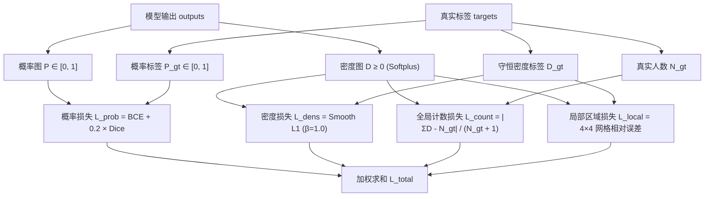

# YOLO-PGMD 人群计数项目 Loss 构成与设计原理

本文档详细解析 **YOLO-PGMD** 人群计数网络中的多任务复合损失函数（[losses/crowd_loss.py](file:///home/tianya/PythonProjects/CrowedSigmod/losses/crowd_loss.py)）构成、数学公式、物理意义与工程设计细节。

---

## 1. 损失函数总体结构

为了兼顾**人头定位精度**、**密集人群高斯峰值回归**、**全局计数准确性**以及**空间分布一致性**，项目设计了分层的四项复合加权损失函数：

$$\mathcal{L}_{\text{total}} = w_{\text{prob}} \cdot \mathcal{L}_{\text{prob}} + w_{\text{density}} \cdot \mathcal{L}_{\text{density}} + w_{\text{count}} \cdot \mathcal{L}_{\text{count}} + w_{\text{local}} \cdot \mathcal{L}_{\text{local}}$$

在默认配置（[configs/crowd.yaml](file:///home/tianya/PythonProjects/CrowedSigmod/configs/crowd.yaml) 及 `LossWeights`）中：

| 损失项 | 标识符 | 默认权重 | 监督目标 | 粒度层次 |
| :--- | :--- | :--- | :--- | :--- |
| **概率分支损失** | `probability` | $w_{\text{prob}} = 1.0$ | 人头存在似然度（前景/背景） | 像素级（微观分类） |
| **密度图损失** | `density` | $w_{\text{density}} = 1.0$ | 守恒高斯密度图积分 | 像素级（微观回归） |
| **全局计数损失** | `count` | $w_{\text{count}} = 0.5$ | 裁剪图/整图总人数 | 全图级（宏观回归） |
| **局部区域损失** | `local` | $w_{\text{local}} = 0.25$ | $4 \times 4$ 网格局部人数分布 | 区域级（中观分布） |

---

## 2. 各损失分项详解



---

### 2.1 概率分支损失 $\mathcal{L}_{\text{prob}}$ (Probability Loss)

- **对应代码**：[crowd_loss.py:L94-105](file:///home/tianya/PythonProjects/CrowedSigmod/losses/crowd_loss.py#L94-L105)
- **监督目标**：引导特征融合层学习人头前景区域的概率分布图 $P \in [0, 1]^{B \times 1 \times H \times W}$，该图进一步作为空间注意力的先验输入（`Probability-Guided Attention`）。
- **公式构成**：
  $$\mathcal{L}_{\text{prob}} = \mathcal{L}_{\text{BCE}} + w_{\text{dice}} \cdot \mathcal{L}_{\text{Dice}}$$
  （默认 $w_{\text{dice}} = 0.2$）

#### (1) 二元交叉熵 $\mathcal{L}_{\text{BCE}}$
为了避免预测值接近 $0$ 或 $1$ 时 $\log$ 产生数值溢出（$\text{NaN} / \text{Inf}$），对预测概率执行安全截断：
$$P_{\text{clamped}} = \text{clamp}(P, 10^{-6}, 1 - 10^{-6})$$
$$\mathcal{L}_{\text{BCE}} = -\frac{1}{HW}\sum_{i,j} \left[ P_{gt}(i,j) \log P_{\text{clamped}}(i,j) + (1 - P_{gt}(i,j)) \log (1 - P_{\text{clamped}}(i,j)) \right]$$

#### (2) 软 Dice 损失 $\mathcal{L}_{\text{Dice}}$
- **设计动机**：人群计数任务中，人头中心像素占全图比例极低（极端正负样本不平衡，背景占 95% 以上）。单纯使用 BCE 容易被大量背景负样本主导，导致网络偏向全预测为 0。
- **公式**：
  $$\text{Intersection} = \sum_{i,j} P(i,j) \cdot P_{gt}(i,j)$$
  $$\text{Denominator} = \sum_{i,j} P(i,j) + \sum_{i,j} P_{gt}(i,j)$$
  $$\mathcal{L}_{\text{Dice}} = 1 - \frac{2 \cdot \text{Intersection} + 10^{-6}}{\text{Denominator} + 10^{-6}}$$
- **数值处理**：Dice 计算采用原始未截断的 $P$，分子分母加入 $\epsilon = 10^{-6}$，确保在无任何人头的纯背景图（$N_{gt}=0$）时不会除零。

---

### 2.2 密度图损失 $\mathcal{L}_{\text{density}}$ (Density Loss)

- **对应代码**：[crowd_loss.py:L106](file:///home/tianya/PythonProjects/CrowedSigmod/losses/crowd_loss.py#L106)
- **监督目标**：逐像素监督非负密度图 $D \in \mathbb{R}_{\ge 0}^{B \times 1 \times H \times W}$（通过 Softplus 激活输出），确保每个高斯响应峰与真实密度图 $D_{gt}$ 吻合。
- **选用损失**：$\text{Smooth L1 Loss}$（Huber Loss），平滑阈值 $\beta = 1.0$：
  $$\text{SmoothL1}(x, y) = \begin{cases} \dfrac{0.5(x - y)^2}{\beta}, & \text{if } |x - y| < \beta \\[2ex] |x - y| - 0.5\beta, & \text{otherwise} \end{cases}$$
  $$\mathcal{L}_{\text{density}} = \frac{1}{HW} \sum_{i,j} \text{SmoothL1}(D(i,j), D_{gt}(i,j))$$

- **设计考量**：
  1. **对比 MSE (L2)**：高密度人群中心处密度峰值较高，若使用 L2 损失，大误差会被平方剧烈放大，易导致梯度爆炸与训练不稳定；Smooth L1 在误差大于 $\beta$ 时转为线性梯度，增强对密度离群值的鲁棒性。
  2. **对比纯 L1**：纯 L1 在误差接近 0 处的导数不连续（$\pm 1$），在平坦的背景区域容易引起梯度震荡；Smooth L1 在零点附近二次平滑，保证平稳收敛。

---

### 2.3 全局人数一致性损失 $\mathcal{L}_{\text{count}}$ (Global Count Loss)

- **对应代码**：[crowd_loss.py:L107-111](file:///home/tianya/PythonProjects/CrowedSigmod/losses/crowd_loss.py#L107-L111)
- **监督目标**：直接将整张图的预测密度积分 $\hat{N} = \sum_{i,j} D(i,j)$ 与真实人数 $N_{gt}$ 对齐。
- **公式**：
  $$\hat{N} = \sum_{i,j} D(i,j)$$
  $$\mathcal{L}_{\text{count}} = \frac{|\hat{N} - N_{gt}|}{N_{gt} + 1.0}$$

- **设计考量**：
  1. **相对误差归一化（NAE 思想）**：分母除以 $(N_{gt} + 1.0)$，将绝对误差转换为相对误差。在密集区域（如 $N_{gt}=500$）和稀疏区域（如 $N_{gt}=2$）中，若使用绝对误差，密集样本的损失值会高出 2 个数量级，导致模型忽视稀疏人群；归一化后各样本贡献均衡。
  2. **防除零与背景惩罚**：$+1.0$ 平滑因子保证空图（$N_{gt}=0$）时不除零，且此时损失退化为 $|\hat{N}|$，直接对虚警误检施加线性惩罚。

---

### 2.4 局部区域人数分布损失 $\mathcal{L}_{\text{local}}$ (Local Region Consistency Loss)

- **对应代码**：[crowd_loss.py:L69-79, L113-117](file:///home/tianya/PythonProjects/CrowedSigmod/losses/crowd_loss.py#L69-L79)
- **监督目标**：解决“**全局人数正确，但空间位置全错**”的退化解（例如左侧多预测 10 人、右侧少预测 10 人，全局计数误差为 0 但空间分布完全错误）。
- **实现原理**：
  1. 将 $H \times W$ 的密度图空间均分为 $K \times K$ 个网格（默认 $K = \text{local\_grid} = 4$，共 16 个子区域）。
  2. 利用无 Python 循环的高效纯张量重排求和计算子块积分：
     ```python
     density.reshape(B, C, grid, H // grid, grid, W // grid).sum(dim=(1, 3, 5))
     ```
  3. 对预测局部人数 $\hat{n}_{u,v}$ 与真实局部人数 $n^{gt}_{u,v}$ 计算相对误差：
     $$\mathcal{L}_{\text{local}} = \frac{1}{K^2} \sum_{u=1}^K \sum_{v=1}^K \frac{|\hat{n}_{u,v} - n^{gt}_{u,v}|}{n^{gt}_{u,v} + 1.0}$$

- **设计考量**：
  - 在微观像素级（$\mathcal{L}_{\text{density}}$）与宏观整图级（$\mathcal{L}_{\text{count}}$）之间建立**中观尺度**的空间一致性约束，强化网络对局部人群聚集与稀疏分布的感知能力。

---

## 3. 标签生成与守恒性保证

损失函数的高效运行依赖于 [data/target_generator.py](file:///home/tianya/PythonProjects/CrowedSigmod/data/target_generator.py) 的高精度标签生成：

```text
点坐标标注 (x, y)
    ├─► 概率图目标: 绘制 σ=2.0 高斯核 -> 逐点取 max -> clamp 到 [0, 1] (不守恒，表征似然)
    └─► 密度图目标: 绘制 σ=2.0 高斯核 -> 图像内可见部分重新归一化 (ΣG = 1) -> 累加
                     └── 严格保证: Σ D_gt = 标注人头总数 N_crop (数学守恒)
```

- **严格守恒断言**：在数据集加载与测试阶段（`validate_density_conservation`），强制校验 $|\sum D_{gt} - N_{gt}| \le 10^{-4}$，杜绝边界截断或坐标偏差造成的真值漂移。

---

## 4. 损失函数协同机制与层级关系

| 层次 | 损失项 | 关注核心 | 梯度作用方式 |
| :--- | :--- | :--- | :--- |
| **分类引导层** | $\mathcal{L}_{\text{prob}}$ | 区分人头前景 vs 背景，抑制非人头区域虚警 | 优化 `ProbabilityHead` 及主干浅层特征 |
| **像素细化层** | $\mathcal{L}_{\text{density}}$ | 高斯响应形态、峰值位置与局部平滑 | 优化 `MSRRefinement`、`DensityHead` |
| **空间分布层** | $\mathcal{L}_{\text{local}}$ | $4 \times 4$ 区域内的人数均衡与聚集趋势 | 防止跨区域误差相互抵消 |
| **全局计数层** | $\mathcal{L}_{\text{count}}$ | 整图总人数收敛，相对误差最小化 | 提供全图尺度的无偏基准梯度 |

---

## 5. 配置参数速查

在配置文件 [configs/crowd.yaml](file:///home/tianya/PythonProjects/CrowedSigmod/configs/crowd.yaml) 中的对应配置段：

```yaml
loss:
  probability: 1.0    # 概率分支权重 w_prob
  density: 1.0        # 密度图分支权重 w_density
  count: 0.5          # 全局计数权重 w_count
  local: 0.25         # 局部区域权重 w_local
  local_grid: 4       # 局部划分网格数 (4x4 = 16 块)
  dice: 0.2           # 概率分支中 Dice 损失的相对权重
```

---

## 6. TensorBoard 监控指标与日志输出详解

在训练过程中（[engine/trainer.py](file:///home/tianya/PythonProjects/CrowedSigmod/engine/trainer.py)），系统会自动将每个 Epoch 的分项损失、人数指标及验证结果记录到 TensorBoard 和日志文件 `train.log` 中。

### 6.1 TensorBoard 标量标签 (Scalars)

| 标签 (Tag) | 指标名称 | 计算公式 / 含义 | 单位 / 取值范围 |
| :--- | :--- | :--- | :--- |
| **`train/total`** | 训练总加权损失 | $w_{\text{prob}}\mathcal{L}_{\text{prob}} + w_{\text{density}}\mathcal{L}_{\text{density}} + w_{\text{count}}\mathcal{L}_{\text{count}} + w_{\text{local}}\mathcal{L}_{\text{local}}$ | 无量纲标量 |
| **`train/probability`** | 训练概率分支损失 | $\mathcal{L}_{\text{BCE}} + 0.2 \times \mathcal{L}_{\text{Dice}}$ | 无量纲标量 |
| **`train/density`** | 训练密度图损失 | 逐像素 $\text{SmoothL1}(D, D_{gt}, \beta=1.0)$ | 无量纲标量 |
| **`train/count`** | 训练归一化人数损失 | 相对误差：$\dfrac{\|\hat{N} - N_{gt}\|}{N_{gt} + 1.0}$ | 无量纲标量（约 $0 \sim 1$） |
| **`train/local`** | 训练局部区域损失 | $4 \times 4$ 网格局部人数相对误差均值 | 无量纲标量 |
| **`train/mae`** | **训练裁剪图 MAE** | 原始绝对人数误差：$\|\hat{N} - N_{gt}\|$ | 人数（人） |
| **`train/lr`** | 当前学习率 | Warmup + Cosine 调度后的学习率 | $\text{float}$ |
| **`val/mae`** | **验证集整图 MAE** | 平均绝对误差：$\dfrac{1}{M}\sum \|\hat{N}_{\text{full}} - N_{gt}\|$ | 人数（人） |
| **`val/rmse`** | **验证集整图 RMSE** | 均方根误差：$\sqrt{\dfrac{1}{M}\sum (\hat{N}_{\text{full}} - N_{gt})^2}$ | 人数（人） |
| **`val/nae`** | **验证集整图 NAE** | 归一化绝对误差：$\dfrac{1}{M}\sum \dfrac{\|\hat{N}_{\text{full}} - N_{gt}\|}{\max(N_{gt}, 1)}$ | 相对比例（百分比） |
| **`val/best_mae`** | **历史最佳验证 MAE** | 迄今为止取得的最低 `val/mae` | 人数（人） |

### 6.2 检查点保存策略

为节省磁盘存储，系统不再为每个 Epoch 产生独立的 `epoch_NNN.pt`，而是维护两个关键检查点：
- **`last.pt`**：每个 Epoch 结束时自动覆盖更新，包含最新网络权重、优化器状态及调度状态，支持断点随时续训。
- **`best.pt`**：当验证集 `val/mae` 达到历史新低时自动更新保存（无验证集时按训练指标保存），代表泛化能力最佳的模型。
- **`metrics.json`**：完整记录所有 Epoch 的训练与验证指标历史数组。

### 6.3 运行控制台与日志示例

```text
2026-08-19 10:00:00 | INFO     | Epoch [015/100] Start | Phase: full | LR: 9.450000e-04
2026-08-19 10:00:25 | INFO     | Epoch [015/100] Result -> Train [Total: 0.8412 | Prob: 0.2105 | Dens: 0.1840 | Count: 0.2350 | Local: 0.2117 | MAE: 6.84] | Val [MAE: 12.35 | RMSE: 21.40 | NAE: 0.1120 | Best MAE: 12.35 (Ep 15)]
2026-08-19 10:00:25 | SUCCESS  | ★ New best checkpoint (Metric: 12.3500) saved -> runs/crowd/best.pt
```

